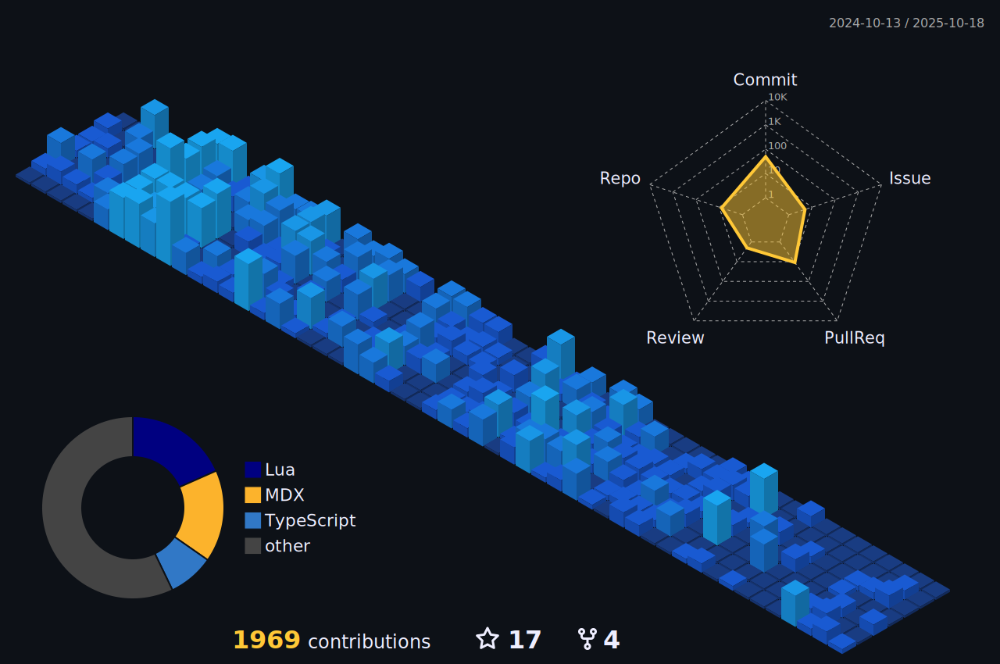

        <picture></picture>
         
         

        <picture></picture>
        <picture></picture>
        <picture></picture>
        <picture></picture>
        <picture></picture>
        

<picture>
        
</picture>

